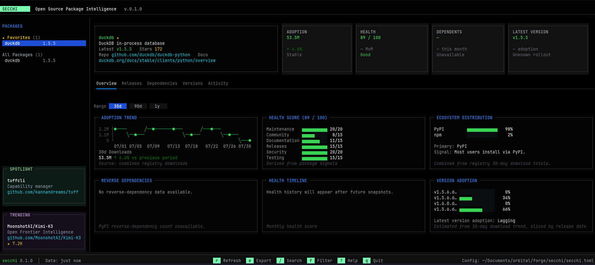

# secchi

Beautiful TUI dashboard to monitor packages across PyPI, crates.io, and npm.



## Features

- Real-time package version monitoring across multiple registries
- Track latest versions, release dates, and install methods for each package
- Snapshot history with delta tracking between runs
- Keyboard-driven navigation with customizable favorites

## Install

```bash
pip install secchi
```

Or with uv:

```bash
uv tool install secchi
```

## Quick Start

Scaffold a config file interactively:

```bash
secchi init
```

Launch the dashboard for a project:

```bash
secchi -p tuffcli
secchi --project opencode
```

List available projects:

```bash
secchi --list
```

## Config

Secchi looks for config in this order:

1. `--config` / `-c` path
2. `./secchi.toml`
3. `./pkgwatch.toml` (legacy)
4. `~/.config/secchi/config.toml`

Example `secchi.toml`:

```toml
[projects.tuffcli]
description = "tuffcli — capability lifecycle manager for coding agents"
packages = [
    { name = "tuffcli", registry = "crates.io", favorite = true },
    { name = "tuffcli", registry = "pypi", favorite = true },
]
```

## Supported Registries

| Registry   | Key           |
|------------|---------------|
| PyPI       | `pypi`        |
| crates.io  | `crates.io`   |
| npm        | `npm`         |

## CLI Options

```
secchi --project <name>     Monitor a project
secchi --list                List projects in config
secchi --refresh             Force refresh all package data
secchi --config <path>       Use a specific config file
secchi init                  Interactively create secchi.toml
secchi monitor <project>     Alias for --project
```

## Development

Live reload during development:

```bash
uv run textual run --dev src/secchi/dev.py -- -p tuffcli
```

Press `ctrl+r` to manually reload the dashboard without exiting.

## License

MIT
